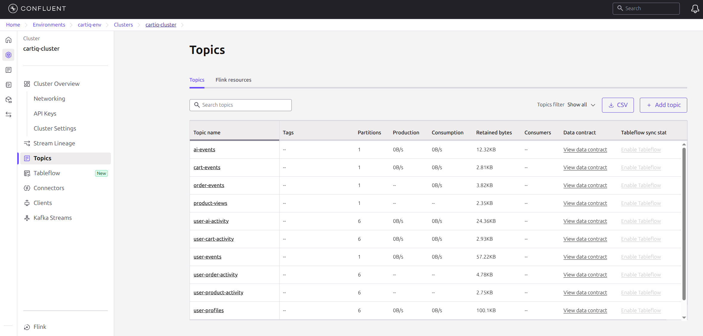
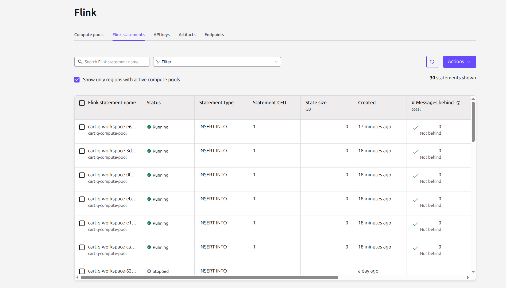
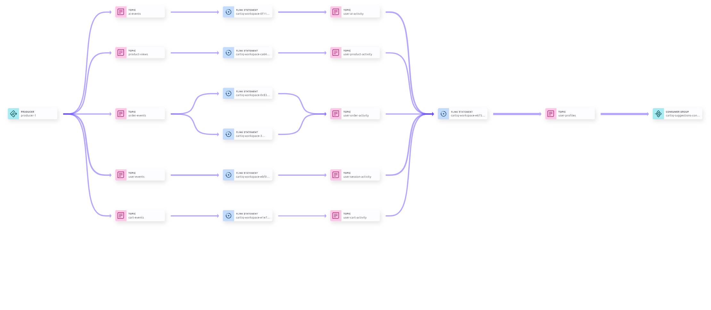

# 🛒 CartIQ Backend

> **AI-Powered Shopping Assistant with Real-Time Personalization**

[](https://ai-partner-catalyst.devpost.com/)
[](https://confluent.io)
[](https://openjdk.org)
[](https://spring.io)

**CartIQ** transforms e-commerce recommendations by replacing stale batch data with **real-time streaming AI**. Every click, browse, and cart action flows through Confluent Kafka and Flink, enabling **personalized suggestions in ~300ms** and intelligent AI chat responses in **2-4 seconds**.

---

## 📑 Table of Contents

- [The Problem](#-the-problem)
- [Our Solution](#-our-solution)
- [Architecture](#-architecture)
- [Key Features](#-key-features)
- [Performance](#-performance)
- [Tech Stack](#-tech-stack)
- [Project Structure](#-project-structure)
- [Demo Flow](#-demo-flow)
- [AI Chat Query Examples](#-ai-chat-query-examples)
- [Kafka Topics](#-kafka-topics)
- [Quick Start](#-quick-start)
- [Configuration](#-configuration)
- [Hackathon Alignment](#-hackathon-alignment)
- [Documentation](#-documentation)
- [Related Repositories](#-related-repositories)
- [License](#-license)

---

## 🎯 The Problem

Traditional e-commerce platforms use **batch-processed data** for recommendations:
- Data is hours or days old
- Recommendations miss the moment
- Cold start users get generic suggestions

## 💡 Our Solution

CartIQ uses **real-time event streaming + RAG architecture**:

| Component | Technology | Purpose |
|-----------|------------|---------|
| **Event Streaming** | Confluent Kafka | Captures every user action in real-time |
| **Stream Processing** | Apache Flink (Confluent Cloud) | Continuous aggregation of user behavior |
| **User Context** | Redis | Sub-millisecond profile lookup |
| **4-Way Hybrid Search** | Vertex AI Vector Search + PostgreSQL FTS | Semantic + keyword + category + brand search |
| **Re-ranking** | Vertex AI Ranking API | Cross-encoder precision scoring |
| **Response Generation** | Gemini 2.0 Flash | Personalized, conversational recommendations |

**Result:** Suggestions in **~300ms**, AI Chat in **2-4s**.

---

## 🏗️ Architecture


### Kafka Topics



### Flink SQL Jobs



### Stream Lineage



---

## 🚀 Key Features

### 1. Real-Time Context Building
Every user action streams to Kafka and gets aggregated by Flink:
- **Product Views** → Category preferences, price range
- **Cart Events** → Purchase intent signals
- **AI Chat Queries** → Explicit intent (strongest signal!)
- **Session Activity** → Device type, engagement duration

### 2. 4-Way Hybrid Search + RAG
High recall + high precision for optimal results:
```
Query → 4-Way Search (Vector + FTS + Category + Brand) → Filter → Re-Ranker (Top-10) → Gemini
```

### 3. New User Experience
New users see **curated sections** (Trending, Best of Electronics, Best of Fashion). Personalized "Suggested For You" appears after first interaction.

### 4. Dual Recommendation Surfaces
- **Home Page (Suggestions API)**: Uses Flink-enriched profiles from Redis for personalized recommendations
- **AI Chat**: Uses Gemini with function calling → 4-Way Hybrid Search → Re-Ranker for conversational recommendations

**Connection:** AI Chat publishes events to Kafka → Flink aggregates them → Redis caches the profile → Suggestions API uses it. Your chat queries influence your future homepage suggestions.

---

## ⚡ Performance

### Suggestions API (`/api/suggestions`)
| Stage | Latency |
|-------|---------|
| User Context (Redis) | <1ms |
| Vector Search + Category Query | ~150ms |
| Product Enrichment | ~150ms |
| **Total End-to-End** | **~300ms** |

### AI Chat API (`/api/chat`)
| Stage | Latency |
|-------|---------|
| 4-Way Hybrid Search | ~50ms |
| Filter + Re-Ranking | ~100ms |
| Gemini Response (LLM) | 2-4s |
| **Total End-to-End** | **2-4s** |

- **Context Update Frequency**: Continuous (Flink upsert mode)
- **New Users**: Curated sections (Trending, Best of Electronics, Best of Fashion)

---

## 🛠️ Tech Stack

| Layer | Technology |
|-------|------------|
| **Backend** | Java 17, Spring Boot 4.0 (Modular Monolith) |
| **Database** | PostgreSQL (Cloud SQL) |
| **Cache** | Redis (Cloud Memorystore) |
| **Object Storage** | Google Cloud Storage (batch indexing pipeline) |
| **Streaming** | Apache Kafka (Confluent Cloud) |
| **Processing** | Apache Flink (Confluent Cloud) |
| **Vector DB** | Vertex AI Vector Search |
| **Embeddings** | Vertex AI text-embedding-004 (768-dim) |
| **Re-ranking** | Vertex AI Ranking API |
| **LLM** | Gemini 2.0 Flash |
| **Hosting** | Google Cloud Run (Backend + Frontend) |
| **Frontend** | Next.js 14, TypeScript, Tailwind CSS, Lucide React (separate repo) |

---

## 📦 Project Structure

```
cartiq-backend/
├── cartiq-common/     # Shared DTOs, exceptions, utilities
├── cartiq-user/       # Authentication, profiles, JWT
├── cartiq-product/    # Product catalog, categories, search
├── cartiq-order/      # Shopping cart, orders, checkout
├── cartiq-kafka/      # Kafka producers/consumers, event DTOs
├── cartiq-ai/         # RAG orchestrator, Gemini, chat API
├── cartiq-rag/        # Vector search, embeddings, re-ranking
├── cartiq-seeder/     # Database seeder utility
└── cartiq-app/        # Main application assembly
```

---

## 🎬 Demo Flow

1. **New User**: User visits home page → sees Trending, Best of Electronics, Best of Fashion sections
2. **Generate Events**: Browse electronics, view phones, add to cart
3. **Context Updates**: Flink continuously aggregates behavior → Redis caches updated profile
4. **Return to Home**: Personalized "Suggested For You" section now appears with electronics!
5. **AI Chat**: "Recommend Samsung phones under 30000" → Gemini uses 4-Way Hybrid Search + Re-Ranker

**The feedback loop**: AI Chat events → Kafka → Flink → Redis → Suggestions API. Your chat queries shape your future homepage recommendations.

---

## 💬 AI Chat Query Examples

Test the AI chat with these sample queries to explore different search capabilities:

### Brand + Category + Price (Hybrid Search)
```
Recommend me Samsung mobile phones under 30000
Show me Apple laptops under 100000
Find Sony headphones between 5000 and 15000
I want Puma running shoes under 5000
```

### Category-Based Queries
```
Show me the best smartphones available
I'm looking for wireless earbuds
What laptops do you have for gaming?
Show me some good skincare products
Show me women's kurta
```

### Price Range Queries
```
Recommend me budget headphones under 2000
Recommend me women's running shoes under 4000
```

### Rating & Quality Queries
```
Show me top-rated products in electronics
What are the best reviewed headphones?
Find highly rated phones with good cameras
Recommend products with ratings above 4.5
```

### Comparison & Recommendations
```
Compare Samsung and Apple phones under 80000
What's better for gaming - laptop or tablet?
```

### Use-Case Based Queries
```
I need a phone for photography
Suggest a laptop for programming
What headphones are good for workouts?
```

---

## 📡 Kafka Topics

### Input Topics (5 Event Streams)
| Topic | Description | Signal Strength |
|-------|-------------|-----------------|
| `user-events` | Session events, page visits, navigation | Low |
| `product-views` | Product page views, search clicks | Medium |
| `cart-events` | Add/remove cart, quantity changes | High |
| `order-events` | Order placed, completed, cancelled | High |
| `ai-events` | AI chat queries (explicit intent signals) | **Strongest** |

### Output Topics (Flink Aggregated)
| Topic | Description |
|-------|-------------|
| `user-profiles` | Aggregated user context (consumed by backend) |

**Total: 6 topics (5 input + 1 output)**

---

## 🚀 Quick Start

### Prerequisites
- Java 17+
- Maven 3.8+
- Docker (for local Kafka/Redis)

### Local Development

```bash
# Clone the repository
git clone https://github.com/your-org/cartiq-backend.git
cd cartiq-backend

# Copy environment file
cp .env.example .env
# Edit .env with your values

# Start dependencies (Kafka, Redis, PostgreSQL)
docker-compose up -d

# Run the application
mvn spring-boot:run -pl cartiq-app
```

### Build

```bash
mvn clean package -pl cartiq-app -am -DskipTests
```

---

## 🔧 Configuration

### Required Environment Variables

| Variable | Description |
|----------|-------------|
| `CONFLUENT_BOOTSTRAP_SERVERS` | Kafka bootstrap servers |
| `CONFLUENT_API_KEY` | Confluent Cloud API key |
| `CONFLUENT_API_SECRET` | Confluent Cloud API secret |
| `GCP_PROJECT_ID` | Google Cloud project ID |
| `REDIS_HOST` | Redis host for user profile cache |

See [Deployment Guide](./docs/DEPLOYMENT.md) for complete setup instructions.

---

## 📊 Hackathon Alignment

| Requirement | Implementation | Status |
|-------------|----------------|--------|
| Confluent Kafka | 6 topics (5 input + 1 output) | ✅ |
| Confluent Flink | Continuous aggregation (upsert mode) | ✅ |
| Google Vertex AI | Embeddings, Vector Search, Ranking, Gemini | ✅ |
| Google Cloud Run | Production deployment | ✅ |
| Real-time AI | Suggestions: Flink-enriched profiles; AI Chat: 4-Way Hybrid RAG | ✅ |
| Response Time | ~300ms Suggestions, 2-4s AI Chat | ✅ |
| New User Experience | Curated sections (Trending, Best of Electronics/Fashion) | ✅ |

---

## 📚 Documentation

- [Architecture Deep Dive](./docs/ARCHITECTURE.md)
- [Challenges & Solutions](./docs/CHALLENGES.md)
- [Deployment Guide](./docs/DEPLOYMENT.md)
- [GCP Setup](./docs/GCP_SETUP.md)
- [Batch Indexing Pipeline](./docs/BATCH_INDEXING.md)
- [RAG vs Tool Use](./docs/RAGvsToolUse.md)
- [Flink SQL Queries](./docs/flink-sql/README.md)

### API Testing Guides
- [User API](./docs/API-testing/USER_API_TESTING.md)
- [Product API](./docs/API-testing/PRODUCT_API_TESTING.md)
- [Order API](./docs/API-testing/ORDER_API_TESTING.md)
- [Chat API](./docs/API-testing/CHAT_API_TESTING.md)
- [Suggestions API](./docs/API-testing/SUGGESTIONS_API_TESTING.md)

---

## 🤝 Related Repositories

- **Frontend**: [cartiq-frontend](https://github.com/spa-raj/cartIQ-frontend) - Next.js 14, TypeScript, Tailwind CSS, Lucide React

---

## 📄 License

MIT

---

<p align="center">
  <b>Built for the AI Partner Catalyst Hackathon (Confluent Challenge)</b><br>
  <i>Real-time AI that traditional batch systems simply can't match.</i>
</p>
